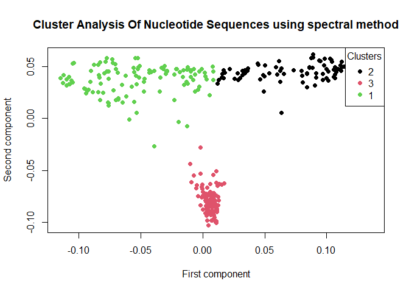

# CANS (Cluster Analysis Of Nucleotide Sequences)

<!-- badges: start -->
<!-- badges: end -->

Implements methods for cluster analysis of nucleotide sequences:
hierarchical clustering, k-means, DBSCAN and spectral method. Provides
imitation model of nucleotide sequences.

## Installation

You can install the development version of CANS from
[GitHub](https://github.com/) with:

``` r
# install.packages("devtools")
devtools::install_github("0ttokore/CANS")
```

## Example

This is a basic example which shows you how to solve a common problem:

``` r
library(CANS)
sequences <- as.matrix(CANS_imitation(number_of_sequences = 100, sequences_length = 80,
                            number_of_clusters = 3))
result <- CANS_spectral(sequences, number_of_clusters = 3)

plot(result$eigenvectors[,1], result$eigenvectors[,2], col = result$clusters, pch = 19, main = 
       "Cluster Analysis Of Nucleotide Sequences using spectral method", xlab = 'First component', ylab = 'Second component')
legend("topright", legend = unique(result$cluster), col = 1:4, pch = 19, title = "Clusters")
```


